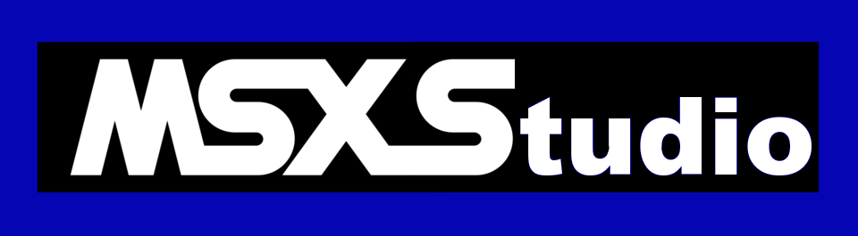
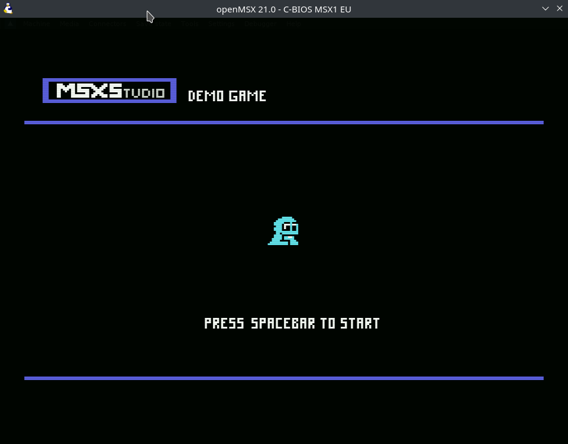

<p align="center">
  
</p>

# MSXStudio

**A desktop IDE for making MSX games.** Write the code, draw the tiles and
sprites, lay out the maps, compose the sound effects, press Run, and watch your
ROM boot in an emulator. One application, one download.

Targets MSX1, MSX2, MSX2+ and MSX turbo R. Runs on Linux and Windows.


## Why it exists

Getting started with MSX development usually means assembling a toolchain by
hand: a cross compiler, a library, an emulator, a tile editor from 2004, a
sprite editor from somewhere else, and a pile of scripts to glue them together.
That work has nothing to do with making a game, and it stops a lot of people
before they write a single line.

MSXStudio takes the approach Godot and PICO-8 take, and points it at real MSX
hardware. It borrows Godot's project-and-editor model, PICO-8's
everything-is-included feel, and VS Code's workbench layout, then wraps the
tools the MSX community already trusts rather than replacing them. It does not
invent its own compiler, its own engine, or its own emulator. It drives
[MSXgl](https://github.com/aoineko-fr/MSXgl), SDCC and openMSX, and stays out of
the way.

The result should feel like this: install it, let it fetch the toolchain, create
a project, and be editing a real game within a few minutes, on hardware that
shipped in 1983.

## What is included

- **Code editor** with C and assembler syntax highlighting, and completion for
  the entire MSXgl API: 5,400+ functions and constants with their real
  signatures, descriptions and per-parameter documentation, read from the
  library's own headers.

  

- **Tile editor** for SCREEN 1, 2 and 4 pattern modes, with per-row and
  per-group colors, and PNG import that converts an image into a tileset.
  Designs bigger than one tile — a door, a tree, a boss face — are drawn on
  **one canvas** as a named block, not as loose 8x8 cells you assemble in your
  head.

  

- **Sprite editor** for sprite modes 1 and 2, 8x8 and 16x16, with per-line
  colors, up to four stacked layers for multicolor characters, and
  **metasprites**: a character can span a grid of hardware sprites, so a 32x32
  Metal Gear-style hero moves as one. Each character shows what it spends of
  the VDP's 4 or 8 sprites per scanline.

  

- **Map editor** with a tile picker, multi-tile stamps, flood fill, layers,
  collision flags, and a screen-size overlay for designing scrolling worlds.

  

- **Screen editor** for the MSX2 bitmap modes, converting a PNG into SCREEN 5
  to 8 data with an editable palette and pencil-and-fill retouching. Drag a
  rectangle to cut a named **fragment** — a bitmap-mode block, and the frame of
  a software sprite.
- **Ready-made C, on request.** Tick a box and the exported header carries
  working code for what you drew: one call places a whole metasprite, stamps a
  block into the name table, or runs a software sprite — background save,
  restore and blit — so you are not writing VDP plumbing by hand.
- **Sound effect editor** producing ayFX banks, with per-frame tone, noise and
  volume lanes, presets, and import of `.afx` / `.afb` files.
- **Build and run** with one keystroke: incremental compilation, compiler
  errors parsed into a clickable Problems panel, and launch straight into
  openMSX or into WebMSX in your browser.
- **Git integration**, a project explorer, search, and an examples browser that
  opens and builds the MSXgl samples.

Every editor writes a plain JSON file and exports a C header your game
`#include`s. Nothing is locked in a binary format.

## Installing

Download the latest build for your system from the
[Releases](../../releases) page. There is nothing else to install first.

**Linux**

- `.AppImage` (portable): `chmod +x MSXStudio-*.AppImage` and run it.
- `.deb` (Debian, Ubuntu and derivatives): `sudo apt install ./msxstudio-*.deb`

**Windows**

- `msxstudio-*-setup.exe` — the installer.
- `msxstudio-*-portable.exe` — a single file, no installation.

Both are 64-bit x86. macOS is not supported at the moment.

Windows SmartScreen and your browser will warn about the downloads, because the
binaries are not code-signed yet. See [Known gaps](#known-gaps).

### First run

MSXStudio does not bundle the MSX toolchain, and does not need you to find it
either. On first launch it offers to download MSXgl (which brings its own SDCC
compiler and tools) for you, or to point at an install you already have.

openMSX is the one piece you supply yourself: install it from
[openmsx.org](https://openmsx.org/) or your distribution's packages, then point
MSXStudio at the executable in Toolchain Settings. If you would rather not
install an emulator at all, choose WebMSX and your games run in the browser.

> **Note for the openMSX Linux tarball:** the relocatable `.tar.gz` build cannot
> find its own `share/` directory. MSXStudio detects that layout and sets
> `OPENMSX_SYSTEM_DATA` for you, so it works without any manual setup.

> **No sound from openMSX on Linux?** The distributed openMSX builds can only
> use ALSA, and on a PipeWire desktop ALSA has no working default device unless
> the bridge package is installed:
>
> ```
> sudo apt install pipewire-alsa
> ```
>
> Then log out and back in. This affects every ALSA application, not just
> openMSX, and the emulator gives no visible sign: it runs perfectly and stays
> silent. If you are unsure whether it is your game or your system, run
> `speaker-test -t sine -l 1` — if that is silent too, it is the system.

> **Blurry or uneven pixels?** openMSX ships with a softened, TV-like picture.
> For a pixel-perfect image, open its console with **F10** and set:
>
> ```
> set scale_algorithm simple
> set horizontal_stretch 256
> set blur 0
> set scanline 0
> ```
>
> Settings save when openMSX exits. `horizontal_stretch` is the subtle one: the
> default stretches 256 MSX pixels across 280, so some columns come out wider
> than others whatever scaler you pick.

### Opening projects

Double-click any `.msxproj` file, or run `msxstudio path/to/Game.msxproj`. If
MSXStudio is already open it focuses the existing window rather than starting a
second copy.


## The demo games

Two complete, playable games ship with the repository, and they are the fastest
way to see what the editors actually produce. Open either `.msxproj` and press
Run.

### MSX1: a two-screen platformer

<p align="center">
  
  
</p>

[`demo_msx1/`](demo_msx1/) — collect eight coins across a two-screen scrolling
level, then reach the door. Every graphic and sound in it came from a resource
editor: a SCREEN 2 tileset, a six-pose sprite, a 64x24 map and an ayFX bank. The
coins spin without the map being touched, the player is two superposed hardware
sprites so it can have two colours on an MSX1, and the doorway opens when the
last coin is taken — the three techniques the editors' generated C exists for.
It builds to about 19.7 KB of a 32 KB ROM, and its
[README](demo_msx1/README.md) explains how each piece is loaded, along with a
few MSX gotchas worth knowing before you hit them yourself.

### MSX2: Canyon Runner, a vertical shooter

<p align="center">
  
  
</p>

[`demo_msx2/`](demo_msx2/) — a SCREEN 5 game in a 128 KB MegaROM, and what the
V9938 changes: a bitmap screen with a programmable palette, the scroll register
for the parallax, sprites with a colour per line, and the command engine moving
rectangles of VRAM faster than the CPU could. The canyon is a map whose tileset
is a *picture* rather than a pattern bank, the mist and the boss are software
sprites built from screen fragments, and its
[README](demo_msx2/README.md) walks through each of those.

Both are also worked examples of the attribution this project's
[license](#license) asks for: the credit appears on the title screen and again
on a credits screen at the end.

## Documentation

- **[Resources guide](docs/resources.md)** — the five asset editors, blocks,
  metasprites and fragments, how exporting works, and how to use the generated
  tables and ready-made C from your game.
- **[Tutorials](docs/tutorials/)** — eight walkthroughs of the MSXgl graphics
  samples: hello world, printing text, tiles and maps, sprites on MSX1 and
  MSX2, scrolling, bitmap modes, and software sprites. Each one ends with a
  complete program you can paste in and run.

For the library itself, see the [MSXgl
documentation](https://aoineko.org/msxgl) and its
[Discord](https://discord.gg/pMeadGfv8E).

## Building from source

Requires Node.js 20 or newer.

```bash
git clone <your-fork-url> MSXStudio
cd MSXStudio
npm install
npm run dev
```

| Command | Does |
|---|---|
| `npm run dev` | Launch the app in development, with hot reload |
| `npm run build` | Type-check and bundle main/preload/renderer via electron-vite |
| `npm run start` | Preview the production build |
| `npm run lint` | ESLint over the whole repo |
| `npm run typecheck` | `tsc` (main/preload/shared) plus `vue-tsc` (renderer) |
| `npm run check` | `lint` + `typecheck`, the CI gate |
| `npm run test` | Vitest over `src/shared/` and `src/main/` |
| `npm run icons` | Regenerate the app icons |
| `npm run monaco:shim` | Regenerate the trimmed Monaco entry point (after bumping `monaco-editor`) |
| `npx electron-builder --dir` | Unpacked build for the current platform |
| `npx electron-builder --linux` / `--win` | Installers, per `electron-builder.yml` |

Some tests drive a real MSXgl checkout and run real compiles, so they are slower
than the rest and need MSXgl available.

### Layout

```
src/main/       Electron main process: toolchain, build, project, git, resources
src/preload/    the single typed bridge: window.api.invoke / window.api.on
src/renderer/   Vue app: activity bar, panels, editor tabs, stores
src/shared/     the IPC contract, plus MSX hardware and format logic
                (dependency-free, runs in main, renderer and tests unchanged)
specs/          implementation specs, one per feature area
docs/           user guides and tutorials
demo_msx1/      a complete example game for MSX1, built with the editors
demo_msx2/      the same for MSX2: SCREEN 5, a MegaROM, software sprites
scripts/        build-time generators (icons, the trimmed Monaco shim)
```

## Contributing

Pull requests are welcome. This is my first project opened to the community, and
what I care about most is that it stays reliable for the people using it to make
games, so the bar is quality rather than volume.

**Before opening a pull request:**

- Run `npm run check` (lint plus both type checks) and `npm run test`. Both must
  pass.
- Add a test for non-trivial logic. Tests live next to the module they cover, in
  `src/shared/` and `src/main/`.
- Keep the change focused. One fix or one feature per pull request is much
  easier to review than a mixed batch.
- Describe what you changed and how you verified it. "Built a ROM and ran it in
  openMSX" tells me far more than "should work".

**On AI-assisted contributions.** They are welcome. Whether a patch was written
by a person, by an AI, or by the two working together matters far less than
whether it is correct, and refusing the help would be pretending the tools do
not exist. There is one firm condition:

> Anything an AI wrote must be reviewed and manually tested by a human before
> you open the pull request. Read every line, understand why it works, run it in
> the real application, and confirm it does what you claim.

Please say so in the pull request description if AI was involved, and say what
you did to verify it. That is not a mark against the contribution, it just tells
me where to look hardest during review.

What will get a pull request rejected is generated code nobody has run:
plausible-looking changes, invented API calls, tests that assert what the code
does rather than what it should do, or a description of behaviour that was never
observed. This project wraps a compiler and an emulator, so "it builds" is not
the same as "it works". If you have not seen it run, do not send it yet.

## Known gaps

- **No code signing.** Windows SmartScreen and browser download warnings are
  expected until a certificate exists.
- **No auto-update.** Check the Releases page and reinstall.
- **macOS is not built.** Nothing in the codebase rules it out, but it is not
  packaged or tested.
- **No debugger integration.** openMSX has a debugger; MSXStudio does not talk
  to it yet.

## Thanks

MSXStudio is a wrapper around other people's excellent work, and it would not
exist without any of it.

- **[MSXgl](https://github.com/aoineko-fr/MSXgl)** and
  **[MSXtk](https://github.com/aoineko-fr/MSXimg)** by Guillaume "Aoineko"
  Blanchard — the C game library and image tools that MSXStudio is built
  around. The engine, the build system and the sample programs are all his.
- **[SDCC](https://sdcc.sourceforge.net/)** — the Small Device C Compiler, which
  turns C into Z80 machine code.
- **[openMSX](https://openmsx.org/)** — the emulator that runs your games, and
  one of the most accurate MSX emulators there is.
- **[WebMSX](https://webmsx.org/)** by Paulo Peccin — the browser emulator, so
  you can test a game without installing anything.
- **[C-BIOS](http://cbios.sourceforge.net/)** by BouKiCHi, Reikan, Maarten ter
  Huurne, Albert Beevendorp, Patrick van Arkel, Manuel Bilderbeek and
  contributors — the free BIOS your projects boot on by default.
- **ayFX** by Shiru — the sound effect format the SFX editor produces.
- **[ZX0](https://github.com/einar-saukas/ZX0)** by Einar Saukas, **Pletter** by
  XL2S Entertainment, and **Bitbuster** by Team Bomba — the compressors bundled
  with MSXgl.
- **[Electron](https://electronjs.org/)**, **[Vue](https://vuejs.org/)** and
  **[Monaco](https://microsoft.github.io/monaco-editor/)** — the application
  shell, the UI framework and the code editor.

And to the MSX community, still building for a machine from 1983.

## License

### MSXStudio

Copyright © 2026 Pablo D. Garaguso.

MSXStudio is free to download and use. In summary: **make anything you like with
it, including commercial games, but do not sell MSXStudio itself, and credit the
author in what you make.**

**You may:**

- Use MSXStudio to create software of any kind, for any purpose, including
  commercial products. Whatever you make with it is entirely yours. MSXStudio
  claims no rights over your code, your assets or your games, and no share of
  your revenue.
- Copy and share MSXStudio itself, unmodified and free of charge.
- Modify it for your own use.

**You may not:**

- Sell MSXStudio, charge a fee for access to it, or include it in a paid
  product, paid bundle or paid service. It must reach whoever receives it free
  of charge.

**You must:**

- Credit the author in software you create with MSXStudio. Wording such as
  *"Built with MSXStudio by P.D. Garaguso"*, or anything similar that names the
  author, placed anywhere a user can reasonably find it: a title screen, a
  credits screen, an about box, a README, or accompanying documentation. This
  mirrors what MSXgl asks of the games built with it.
- Keep that credit factual and neutral. It must not state or imply that Pablo D.
  Garaguso endorses, sponsors, approves of or is affiliated with your product.

**No warranty.** MSXStudio is provided "as is", without warranty of any kind,
express or implied, including but not limited to the warranties of
merchantability, fitness for a particular purpose and non-infringement. In no
event shall the author be liable for any claim, damages or other liability
arising from, out of, or in connection with the software or its use.

> These terms are deliberately not an OSI-approved open source license: the
> restriction on selling MSXStudio makes it *source-available* rather than open
> source, and GitHub will label it "Other". This does not affect what you may do
> with the games you make.

### Third-party components

MSXStudio does not bundle or redistribute the MSX toolchain. MSXgl, SDCC and
their tools are downloaded to your own machine by the toolchain setup, and
openMSX is installed by you. They remain under their own licenses:

| Component | License | Bundled? |
|---|---|---|
| MSXgl | CC BY-SA 4.0 | No, downloaded on demand |
| MSXtk / MSXimg | CC BY-SA | No, ships inside MSXgl |
| SDCC | GNU GPL (v2 and v3 texts included) | No, ships inside MSXgl |
| ZX0 | BSD-3-Clause | No, ships inside MSXgl |
| Bitbuster | MIT-style | No, ships inside MSXgl |
| Pletter | Free, informal terms | No, ships inside MSXgl |
| openMSX | GNU GPL v2 | No, installed by you |
| C-BIOS | BSD-style | No, ships with openMSX |
| WebMSX | See the project | No, loaded from webmsx.org |
| Electron, Vue, Pinia, Vue Router, Monaco, chokidar, yauzl | MIT | Yes |
| Material Symbols (icon font) | Apache-2.0 | Yes — [licenses/](licenses/) |

Because MSXgl is CC BY-SA 4.0, games built with it are expected to credit it.
Check [MSXgl's own terms](https://github.com/aoineko-fr/MSXgl) for what it asks
of you; MSXStudio's attribution requirement is separate from, and additional to,
MSXgl's.
