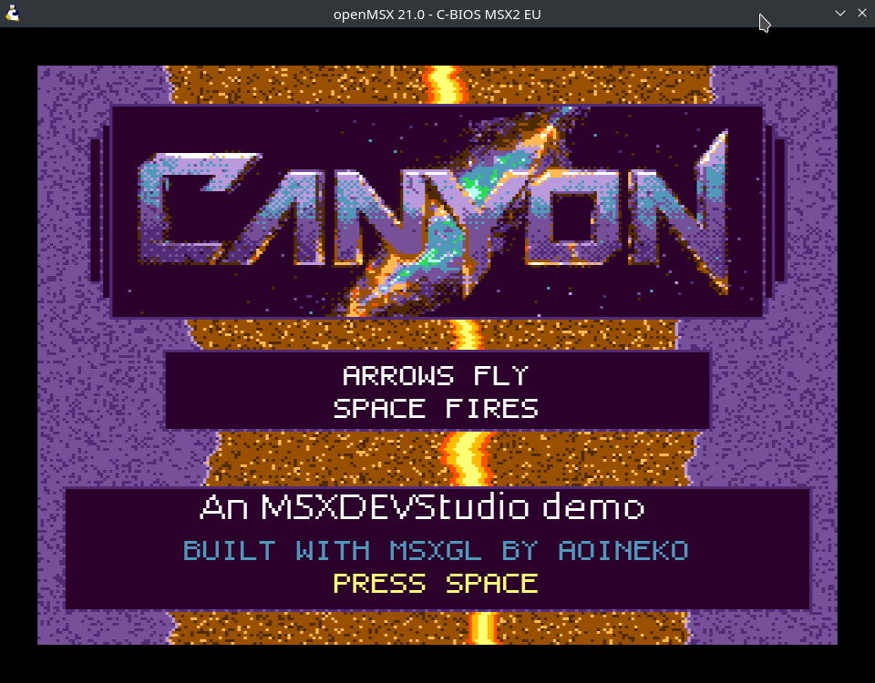
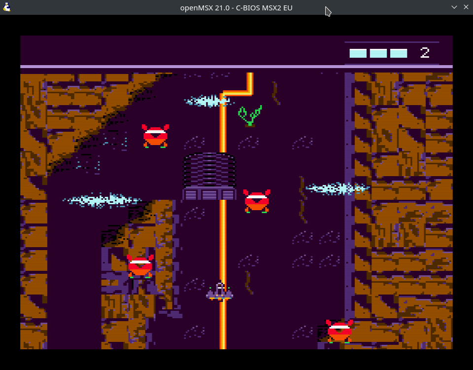
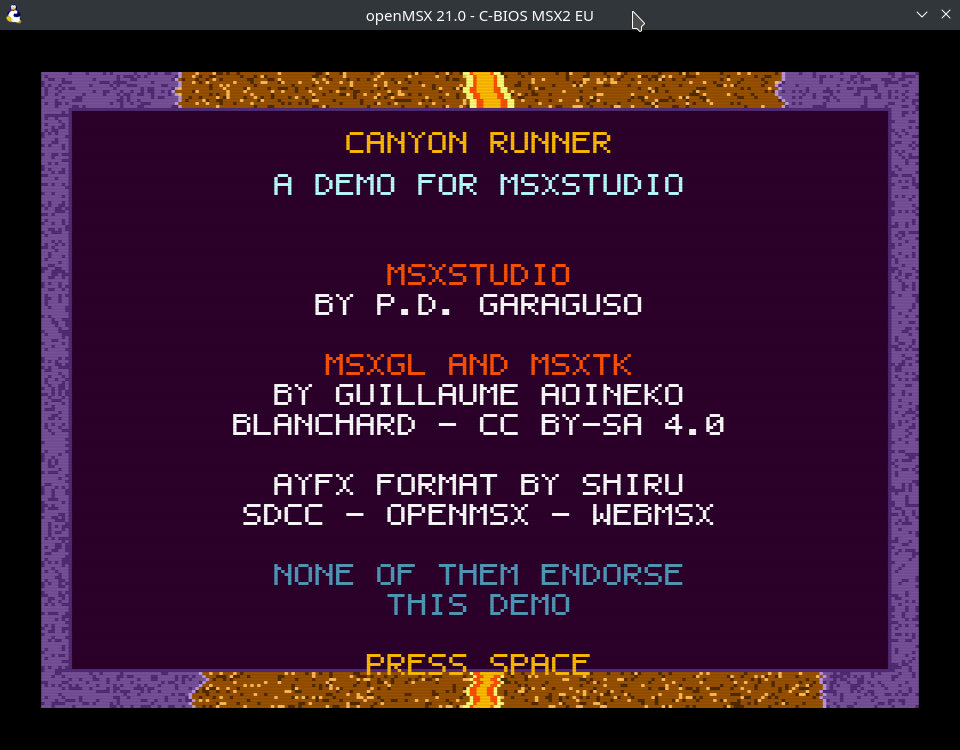

# Demo project 2: Canyon Runner, an MSX2 vertical shooter

A SCREEN 5 game in a 128 KB MegaROM. Fly the canyon, shoot the drones, kill the
thing waiting at the top. Arrow keys fly, SPACE fires; three hits per life,
three lives.





Open `canyon.msxproj` in MSXStudio and press **Run**.

Where [`demo_msx1`](../demo_msx1/) is an MSX1 game — one name table, 16
fixed colours, eight-pixel scroll steps — this one is about what the V9938
changes: a bitmap screen with a programmable palette, a scroll register, sprites
with a colour per line, and a command engine that moves rectangles of VRAM
faster than the CPU ever could.

## What it demonstrates

| Resource | Editor | Exports | Used for |
|---|---|---|---|
| `res/canyon.screen.json` | Screen editor | `data/atlas.bin` | 48 cells of 16×16 in one 256×48 image — the canyon's tileset, in a mode that has no tileset |
| `res/stage.map.json` | Map editor | `g_Stage_Terrain` + `g_Stage_DrawRow()` | 16 × 160 cells of canyon, drawn a row at a time |
| `res/fleet.sprites.json` | Sprite editor | `g_Fleet_Patterns/_Colors/_Palette/_Layout` + `g_Fleet_SetMeta()` | The ship (two planes, sprite mode 2), its shots, the drones |
| `res/mist.screen.json` | Screen editor | `g_Mist_Strip/_Rects` + `_Upload/_Restore/_Draw` | Three wisps of mist — the parallax layer, as software sprites |
| `res/boss.screen.json` | Screen editor | `g_Boss_Strip/_Rects` + `_Upload/_Restore/_Draw` | A 68×40 boss, too wide to be sprites |
| `res/hud.screen.json` | Screen editor | `g_Hud_Strip/_Rects` | The status band's artwork: four bar states, four life counts |
| `res/sfx.sfx.json` | SFX editor | `g_Sfx` | An ayFX bank: shot, boom, crash, hit, victory |
| `res/title.screen.json` | Screen editor | `data/title.bin` | A full SCREEN 5 title picture, text baked in |
| `res/credits.screen.json` | Screen editor | `data/credits.bin` | Likewise, for the ending |

The code is split into chapters:

| File | What it holds |
|---|---|
| `canyon.h` | The shared vocabulary: geometry, the VRAM map, sprite plane allocation, the atlas cell ranges |
| `main.c` | Setup, the two interrupt handlers, the state machine and the frame loop |
| `scroll.c` | The parallax: R#23, the mist, the palette cycle, and the world/screen conversion |
| `player.c` | The ship, its shots, energy and the grace period |
| `enemy.c` | The drones |
| `bossfight.c` | The boss |
| `screens.c` | The title and credits pictures, read straight out of ROM segments |


## The art is generated

Everything in `datasrc/` is a script. `node datasrc/make-art.mjs` draws the five
source PNGs from nothing but code, and `node datasrc/make-data.mjs` writes the
map, the sprite sheet and the sound bank straight into MSXStudio's editor
formats. Both are ordinary Node scripts with no dependency on the app.

That is a way to get a first draft quickly, not a parallel pipeline: every file
they write opens in the matching editor and can be redrawn by hand from there.
The `.screen.json` files are the one exception — they cache a conversion, so
they come from opening each PNG in the screen editor and importing it with the
palette locked to `datasrc/palette.mjs`.

The palette is locked rather than optimised because **SCREEN 5 has exactly one
palette and the sprites share it**: a mode-2 sprite's per-line colour byte is an
index into the same sixteen entries the canyon is drawn from. Sixteen colours
are chosen once, in one file, and every asset is drawn with them.

## Seven things worth knowing

### R#23 scrolls the sprites too

This is the one that costs an afternoon. R#23 is described as the display
offset, and it is easy to read that as "it shifts the bitmap". It does not: the
sprite Y coordinate is compared against the same offset line counter, so the
whole sprite plane scrolls with the picture. A ship left at a fixed Y slides off
the top of the screen within seconds, and for most of the time no sprite is
anywhere near the display — which looks exactly like sprites being broken.

Every sprite Y here goes through `Scroll_SpriteY()`, which adds the offset back.
MSXgl's own `s_gm3` sample does the same addition for the same reason.

The corollary bites too: `VDP_HideSprite` writes a fixed Y of 213, which is off
screen only when the display is not offset. Left alone, a shot-down drone is
dragged back into view and sits there forever. `Scroll_HideSprite()` parks it in
the offset's own space.

### The sprite attribute address must be 1 KB-aligned + 0x200

In the MSX2 bitmap modes the VDP takes R#5/R#11, masks the address down to a
1 KB boundary, puts the sprite *colour* table there and the *attribute* table
0x200 above it. MSXgl matches that — it writes attributes at the address you
hand it and colours 0x200 below — but only if that address already sits where
the VDP will look.

Hand it a 1 KB boundary + 0x380 instead, which looks just as plausible given
that MSXgl ORs A9–A7 into R#5 itself, and MSXgl writes the sprites 0x180 bytes
away from where the VDP reads them. Nothing complains. No sprite is ever drawn
again. `VRAM_SPRITE_ATTR` in `canyon.h` carries the working value and the reason.

The tables also have to leave page 0 entirely. Their default home at 0x7600 is
rows 212–255 of the page the scroll walks all the way round, so left there the
canyon eventually scrolls the attribute table into view.

### The page is a 256-line ring, and all of it is used

R#23 wraps at 256 and nothing can opt out. The scroll is therefore not a
redraw: the map is fed into page 0 a row at a time, sixteen pixels of travel
apart, and the display walks round it. One `HMMM` per cell, sixteen cells a row,
once every sixteen frames.

The consequence is that **there is no spare strip of the page to keep anything
in** — no status bar, no scratch area, no reserved rows. Anything that must hold
still is either a sprite (which needs the R#23 compensation above) or lives in
another page.

It also means anything composited into the visible page has to be lifted and put
back down every frame, and sixteen frames out of every 256 it straddles row 0 —
where the VDP's command engine does not wrap. A rectangle starting at row 250
runs on into the next page, where the display never looks. That is a blink once
every five seconds, and it is why the status band is not composited at all but
lives on a page of its own.

### The split screen is for the status band, not for parallax

The V9938's line interrupt (R#19) can change registers partway down the frame.
The famous use is two-speed vertical parallax: give the band above the split its
own R#23 and the ground below moves faster than the sky.

It was tried here first and it looked like a tear. Both bands read from the
*same page*, so the strip above the join shows an unrelated part of the same
canyon, sliding at its own rate. On a side view that reads as distance. On a
top-down view it reads as the screen being broken.

What the split is genuinely good for is content that is *meant* to be
discontinuous with the world. The frame **starts** on the status band — page 1,
no offset, sprites off — and at line 24 the H-blank handler hands the rest of
the screen to page 0 with the scroll. The band is painted only when the numbers
on it change, sits on a page nothing scrolls, and costs nothing per frame.

Four things have to be right, and each of them was a visible bug first:

- R#2 has to be switched **back** for the other half of the screen, every frame.
- **Sprites have to be off across the band.** The VDP compares a sprite's Y
  against the same offset line counter R#23 shifts, so with the band's offset at
  zero every sprite is being asked about a different part of the screen, and
  whichever ones land in the band's lines are drawn over it. Ships and drones
  scattered across the status bar is what that looks like. One bit in R#8.
- The interrupt is late. It fires at the *end* of the line R#19 names, and then
  the Z80 finishes its instruction, takes the interrupt, saves registers and
  reads S#1 before it can write anything — several scanlines. `HUD_SPLIT_LEAD`
  corrects for that and `HUD_SPLIT_DELAY` pauses a little more, so the writes
  land in the horizontal blanking instead of partway along a visible line.
- **And it has to be late by the same amount every frame**, which is the part
  that decides where the band goes.

### Why the band is at the top

Because that is the only place the join can be made still.

MSXgl sets a VDP command up by writing fifteen registers with interrupts
disabled. An H-blank interrupt arriving mid-burst therefore waits — by a
different amount each frame, depending on what the game happened to be blitting.
The join frays: one scanline where the left part is canyon and the right is
band, with the boundary walking about.

With the band at the bottom the split fires at line 188, deep into the frame,
and profiling with the border colour showed this frame's blitting running
anywhere from 99 to **240 scanlines** — sometimes the whole frame. There is no
quiet moment at line 188 to be found.

With the band at the top, the loop can simply wait:

```c
while(g_VBlank == 0) { __asm halt __endasm; }   // vertical blanking
while(g_BandOn && g_Split == 0) { __asm halt __endasm; }   // then the join
// only now does the frame's blitting begin
```

The interrupt is always taken out of a `halt`, so it is serviced the same number
of cycles later every time, and the frame's work cannot begin until the join is
already behind the raster. Measured over twenty seconds of play, the band's rows
are pixel-identical frame to frame and no canyon pixel ever reaches them.

`halt` rather than a polling loop matters on its own: `while(g_VBlank == 0);` is
several instructions, and an interrupt can arrive at any point in it, which is
tens of dots of jitter all by itself.

**Konami mostly did not have this problem, because they were not doing this.**
Their MSX2 scrolling games — and their MSX1 ones, where the VDP has no R#23 and
no line interrupt at all — are tile-mode games. In a tile mode a status area is
simply name-table rows you never rewrite, and scrolling is rewriting the name
table; there is no mid-frame register change to get wrong. Bitmap mode buys a
colour per pixel and pays for it here.

### Where the parallax actually comes from

Three layers, three techniques, and only one of them costs anything measurable:

- **The canyon**, R#23, one register write a frame.
- **The mist**, software sprites that move *through* the page as well as with it,
  so on screen they travel faster than the ground they are over. That is the
  layer that reads as depth. Three wisps, each moving one pixel every two or
  three frames, staggered so only one or two are redrawn per frame.
- **The veins**, three palette entries rotated every eighth frame. No VRAM at
  all, and it is the only animation that also reaches the cells scrolled off
  screen.

The mist is sized by its cost, not by taste: a VDP blit runs at roughly 1.5 µs a
byte with the display on, so a 48×16 wisp is about 1.2 KB of VRAM traffic per
move — under two milliseconds. A 64×24 one was three times that and did not fit.

### Registers only move inside the blanking

R#23 shifts the whole display, so writing it while the raster is inside the
picture tears the frame across. The first version of `scroll.c` wrote it straight
from the game loop and the scroll visibly shook.

The fix is two values rather than one. `g_MainOffset` is what the logic has
computed for the *next* frame; the V-blank handler installs it. `g_ShownOffset`
is what the handler actually put in R#23, and it is what every sprite and every
composited position is measured against — because those are written in the
middle of a frame, and measuring them against the next frame's offset puts them
a pixel out for the rest of the current one. Since how far the logic gets before
the raster reaches any given line varies frame to frame, that one pixel appears
and disappears. It reads as everything trembling.

## What the MegaROM is for

A SCREEN 5 picture is 27 136 bytes. Two of them plus the code do not fit in a
32 KB ROM, and the usual answer is to compress — which costs a RAM buffer, the
`compress` module, and an unpack pass every time the picture is shown. A 128 KB
ASCII-8 ROM lets you skip all of it: the picture goes into the cartridge raw and
reaches VRAM as four `HMMC` calls.

Two details make it that simple, and both are in `screens.c`:

- Each picture is placed by **absolute offset** in the `.msxproj` so that its
  bitmap starts exactly on an 8 KB segment boundary. A SCREEN 5 line is 128
  bytes, so a segment is exactly 64 lines and no line ever straddles two. The
  32-byte palette the exporter writes ahead of the bitmap lands in the tail of
  the previous segment, where nothing reads it — the palette the game uses is
  the atlas's copy, and they are the same sixteen colours.
- The window used for paging is **bank 3** (0xA000). MSXgl maps segments 0–3
  there at boot as the main 32 KB, and this program does not fill it, so bank 3
  holds nothing but padding — paging it out cannot take the running code or a
  table with it. Bank 2 would be a gamble on the linker's layout; bank 3 is not.

MSXgl's build tool writes `canyon_rawdef.h` with each blob's segment and size,
so the game derives the segment from a generated define rather than a magic
number.

## Two traps that are not about the hardware

**A generated module and a hand-written one cannot share a basename.** The
resource exporter writes `content/boss.c` and adds it to `ProjModules`; MSXgl
compiles every module into `out/<basename>.rel`. A hand-written `boss.c` in the
project root therefore silently overwrites it, and the link fails with
*Multiple definition of* something you never wrote twice. The boss's chapter is
called `bossfight.c` for that reason.

**MSXgl's incremental build cannot see header changes.** `CompileSkipOld`
compares a source's mtime against its `.rel`, so editing `canyon.h` and
rebuilding gets you the old objects and a very confusing debugging session.
MSXStudio guards against this with a stamp file and a header sweep — see
`needsFullRebuild()` — but if you build from the command line, use the `rebuild`
step after touching a header.

## Credits and attribution

The demo carries its attribution in the game, which is what MSXStudio's
[license](../LICENSE) asks of anything built with it: a line on the title screen
and a full credits screen after you win.



### Copyright

**Copyright © 2026 Pablo D. Garaguso.** The code and all the artwork in this
demo — the canyon, the ship, the drones, the boss and the sound effects —
are the author's own.

It ships with MSXStudio as a worked example, so it is meant to be built on: you
may use, modify and adapt its code and art in your own projects, commercial or
not, with **no obligation to credit this demo**.

That is a separate matter from the tools. MSXStudio and MSXgl still ask for the
credit their own licenses describe, which is what the title and credits
screens do.

### Tools used

- **MSXStudio** by P.D. Garaguso, whose license asks to be credited in software
  made with it, in wording that does not imply endorsement.
- **MSXgl** and **MSXtk** by Guillaume "Aoineko" Blanchard, licensed
  [CC BY-SA 4.0](https://creativecommons.org/licenses/by-sa/4.0/), which also
  asks for attribution.
- **ayFX** sound format by Shiru.
- **SDCC**, the compiler, and **openMSX** / **WebMSX**, the emulators.

None of them endorse this demo, which the credits screen says out loud.

## Changing it

The stage is `res/stage.map.json`: open it and paint. The picker shows the
canyon atlas's cells because the map's tileset is a `.screen.json` rather than a
`.tiles.json` — that is what makes it a bitmap-mode map, and the **Cell** panel
is where its geometry lives.

To change the look rather than the layout, edit `datasrc/make-art.mjs`, rerun it,
and re-import the PNGs in the screen editor. To change the palette, edit
`datasrc/palette.mjs` — but remember that the sprites are drawn from the same
sixteen entries.
