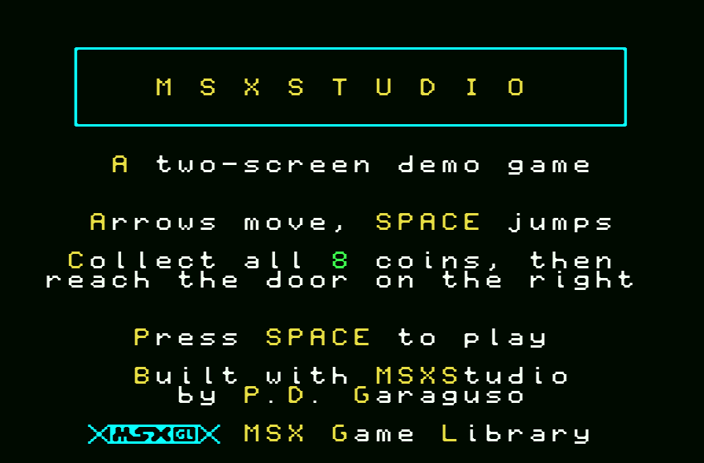
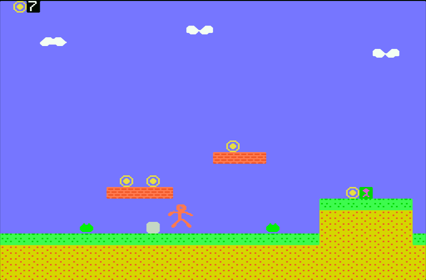
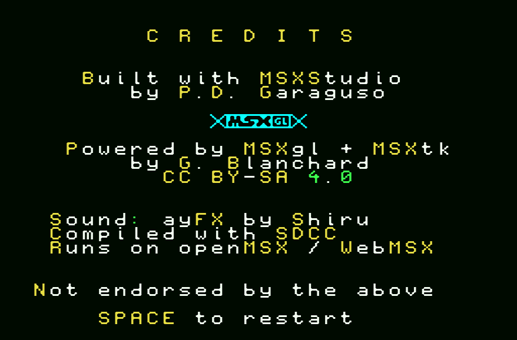

# Demo project: a two-screen platformer

A small, complete MSX1 game built entirely with MSXStudio's own editors. Collect
all eight coins, then reach the door at the far right. Arrow keys move, SPACE
jumps.

Open `demo.msxproj` in MSXStudio and press **Run**. It builds to a 32 KB ROM
(about 10.8 KB used) and boots in openMSX or WebMSX.

## What it demonstrates

Every graphic and sound came from a resource editor and was exported to a C
header, which is the workflow described in [the resources
guide](../docs/resources.md):

| Resource | Editor | Exports | Used for |
|---|---|---|---|
| `tiles.tiles.json` | Tile editor | `g_Tiles_Patterns`, `g_Tiles_Colors` | 32 SCREEN 2 tiles: terrain, coins, scenery, and digits 0-9 for the HUD |
| `player.sprites.json` | Sprite editor | `g_Player_Patterns`, `g_Player_Colors` | One 16x16 sprite in mode 1, six frames: standing, four walk poses, jumping |
| `level.map.json` | Map editor | `g_Level_Background` | A 64x24 map, exactly two screens wide, one byte per cell |
| `sfx.sfx.json` | SFX editor | `g_Sfx` | An ayFX bank: coin (id 0), jump (id 1), win fanfare (id 2) |

The game code in `main.c` covers the techniques the
[tutorials](../docs/tutorials/) explain, in one place:

- **Tiles**, loaded into all three SCREEN 2 banks with `VDP_LoadPattern_GM2` and
  `VDP_LoadColor_GM2`.
- **Scrolling**, without the `scroll` module. The visible 32 columns of a 64
  wide map are contiguous in memory, so each screen row is one `VDP_WriteVRAM_16K`
  straight out of ROM. The camera moves in whole tiles and only redraws when it
  actually changes.
- **Collision**, read directly from the same map data the VDP is drawing, so
  there is no second copy of the level to keep in sync.
- **Sprites**, placed with `VDP_SetSpriteSM1`. The walk is a six step cycle
  (`g_WalkCycle` in `main.c`) rather than two poses flipping back and forth,
  which is the difference between a stride and a flicker.
- **Sound**, an ayFX bank played with `ayFX_PlayBank`, updated once per frame by
  `ayFX_Update()` and pushed to the chip with `PSG_Apply()`.
- **Text screens**, drawn in SCREEN 1 with MSXgl's `g_Font_MGL_Sample8`, so the
  title and ending do not have to share the pattern table with the game's tiles.
  The title is framed with `Print_DrawBox`, and the MSXgl logo is characters 1
  to 6 of any MSXgl font (`MSX_GL` in `main.c`).
- **Colour in SCREEN 1**, which stores one colour per group of eight pattern
  codes rather than per character. Loading the font at offset 0 makes a pattern
  code equal its character code, so whole classes can be recoloured:
  `ColorChars()` tints the box frame cyan, capitals yellow, digits green and the
  logo cyan, which is why SPACE and the coin count stand out in a sentence.

## Three things worth knowing

**Use the `_16K` VRAM calls on MSX1.** The four-argument `VDP_WriteVRAM(src,
destLow, destHigh, count)` form is meant for the 17-bit addressing MSX2 uses.
With `VDP_VRAM_ADDR_14`, which is what an MSX1 project gets, `g_ScreenLayoutHigh`
does not even exist, and the level silently failed to draw here until the code
called `VDP_WriteVRAM_16K(src, dest, count)` and `VDP_Poke_16K(value, dest)`
directly. It compiles cleanly either way, so this is worth knowing before you
lose an hour to it.

**ayFX needs configuring for standalone use.** `msxgl_config.h` sets
`AYFX_BUFFER` to `AYFX_BUFFER_DEFAULT`. The MSXgl samples use
`AYFX_BUFFER_PT3` because they play PT3 music alongside the effects, and with
that setting the sound goes into PT3's register buffer, which nothing here would
ever flush. `psg` and `ayfx/ayfx_player` both have to be in **LibModules**, and
`msxgl.h` does not include their headers for you.

**Ask the ground whether you are standing, not the movement.** Velocity here is
in 1/8th pixels, so at rest it takes four frames for gravity to add up to one
whole pixel of fall. Setting `g_OnGround` from "did a downward step get blocked
this frame" therefore reported airborne on three frames out of four, and the
sprite flickered into its jump pose while walking on flat ground. It looked like
an animation speed problem and was not: `ApplyGravity()` now derives the flag
from `BoxHitsSolid(x, y + 1)`, which is a question about the world rather than
about what happened this frame.

## Credits and attribution

The demo carries its attribution in the game itself, which is what MSXStudio's
[license](../LICENSE) asks of anything built with it: a line on the title
screen, and a full credits screen after you win.

- **MSXStudio** by P.D. Garaguso, whose license asks to be credited in software
  made with it, in wording that does not imply endorsement.
- **MSXgl** and **MSXtk** by Guillaume "Aoineko" Blanchard, licensed
  [CC BY-SA 4.0](https://creativecommons.org/licenses/by-sa/4.0/), which also
  asks for attribution.
- **ayFX** sound format by Shiru.
- **SDCC**, the compiler, and **openMSX** / **WebMSX**, the emulators.

None of them endorse this demo, which the credits screen says out loud. Copy
this pattern in your own game: the title screen line takes five minutes and
satisfies both licenses.

## Changing it

Open any of the four `.json` resources from the Resources panel and edit it,
then press Run. Exports happen automatically as part of the build, and only for
files that changed.

The level is the easiest thing to play with: open `level.map.json`, paint with
the tile picker, and remember that coins are also tracked in the `g_Coins` table
at the top of `main.c`, so a coin painted in the map still needs its position
adding there to be collectable.
