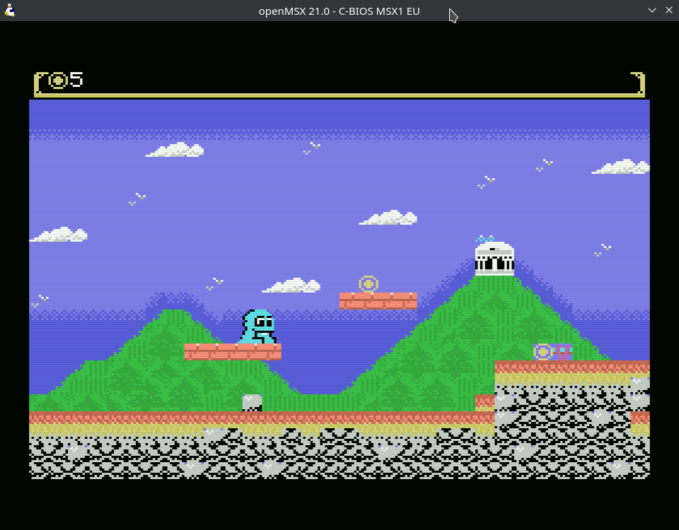

# The demo games

Two complete, playable games ship inside MSXStudio. They are the shortest route
from "I installed an IDE" to "I changed something and it ran on an MSX", and
every graphic and sound in them came out of the editors described in
[Resources](resources.md).

| | [Demo 1 — platformer](../demo_msx1/README.md) | [Demo 2 — Canyon Runner](../demo_msx2/README.md) |
|---|---|---|
| Machine | MSX1 | MSX2 |
| Screen mode | SCREEN 2 (patterns) | SCREEN 5 (bitmap) |
| Target | 32 KB ROM, ~19.7 KB used | 128 KB ASCII-8 MegaROM |
| Scrolling | A two-screen map, redrawn a column at a time | Hardware, via the scroll register |
| Sprites | Mode 1, three superposed planes for three colours | Mode 2, a colour per line, plus software sprites |
| Start here if | You are new to the MSX | You know the basics and want the V9938 |

**Start with demo 1** even if you intend to target MSX2. It is smaller, every
technique in it is visible in one file, and the MSX1 constraints — one colour
pair per eight pixels, four sprites per line — are the ones that explain why the
MSX2 features exist.

## Installing them

The demos live inside the application, and have to be copied somewhere you can
write to before you can build them: a build writes into its own project folder,
and the install directory is read-only.

1. **Help ▸ Install Demo Projects…**, or **Install Demos…** on the Welcome tab.
2. Pick a folder — your usual projects directory is the right answer.
3. Both demos are copied in as `demo_msx1/` and `demo_msx2/`. MSXStudio offers
   to open the first one.
4. Press **F5**.

Nothing is overwritten without asking. If you install twice, a demo you have
already edited is reported rather than replaced, and files you added alongside
it are kept either way.

If Run fails before the emulator appears, the toolchain is not set up yet — see
[Getting started](getting-started.md).

## Demo 1: a first session

Collect eight coins across a two-screen level, then reach the door. Arrows move,
SPACE jumps.

Work through these in order. Each one is a single edit, and each teaches one
thing the editors do that a text editor cannot.

**1. Paint the level.** Open `res/level.map.json` from the Resources panel,
pick a tile, paint, press F5. That is the whole loop — the export runs as part
of the build, so there is no separate step.

**2. Add a coin, and notice what you did *not* have to do.** Paint a coin
anywhere in the level and Run. The counter goes to nine. Nothing in `main.c`
changed: the game counts coins out of the map at startup and collects whatever
carries the coin flag, so the map *is* the level data. The HUD handles up to 99.

**3. Invent a tile.** In `res/tiles.tiles.json`, draw a new tile and tick the
solid flag on it, then paint it into the level. You now have new terrain, and
again no code changed. Flags are how a tile tells the game what it *means* —
see [Resources](resources.md).

**4. Change a block, and watch every copy change.** The coin's four spin frames
are a `4x1` **block** — one design drawn on a single canvas rather than four
loose tiles. Edit it and every coin in the level animates differently, because
the game rewrites the tile's pattern rather than the map. That is the trick
worth stealing: it costs the same whether one coin or forty are on screen.

**5. Recolour the player.** `res/player.sprites.json` holds a 16x16 character
as **three superposed planes** — black line art in front, two colour planes
behind. Change one plane's colour and Run. This is the only way to get a
three-colour character on an MSX1, and [Sprites on
MSX1](tutorials/04-sprites-mode1.md) explains why.

**6. Change a sound.** `res/sfx.sfx.json` is an ayFX bank: coin, jump, win.
Edit the jump's frames and Run.

Then read [the demo's own walkthrough](../demo_msx1/README.md) — it explains how
each piece is loaded, and its *Seven things worth knowing* section is a list of
MSX gotchas that will cost you an evening each if you meet them cold.

## Demo 2: what the V9938 changes

Fly the canyon, shoot the drones, kill the thing at the top. Arrows fly, SPACE
fires.

The interesting part is that a bitmap screen has **no name table** — there is no
grid of tile numbers to draw into, only dots. Canyon Runner still has a tilemap
anyway, and seeing how is the point of the demo.

**1. Paint the stage.** `res/stage.map.json` is a map whose tileset is a
*picture*: the picker shows cells cut out of the canyon atlas. Paint and Run.

**2. Look at where those cells come from.** `res/canyon.btiles.json` is a
bitmap tileset — 16x16 cells with their own palette and gameplay flags, the
bitmap-mode counterpart of demo 1's tile bank. [Resources](resources.md)
describes how it differs.

**3. Retune the colours.** SCREEN 5 has exactly one 16-entry palette and the
sprites share it, so changing a palette entry changes the canyon *and* the ship.
That constraint is why the demo locks its palette in `datasrc/palette.mjs`
instead of optimising per image.

**4. Meet a software sprite.** The boss is 68x40 — far too wide for the sprite
hardware, so it is drawn as a **screen fragment**: the game saves the background,
blits the image, and restores it next frame. `res/boss.screen.json` holds the
frames. [Software sprites](tutorials/08-software-sprites.md) covers the
technique.

**5. Regenerate the art.** Everything in `datasrc/` is a script:
`node datasrc/make-art.mjs` draws the source PNGs from nothing but code. Edit it,
rerun it, re-import the PNGs in the screen editor. That is one way to work, not
the required one — every file it writes opens in an editor and can be redrawn by
hand.

Then read [Canyon Runner's walkthrough](../demo_msx2/README.md), especially
*Seven things worth knowing*: the scroll register moving the sprites too, the
1 KB-aligned sprite attribute table, and why the status band is at the top are
all things the hardware will teach you the hard way otherwise.

## Where each technique is explained

| In the demos | Explained in |
|---|---|
| Tiles, blocks, flags, maps, sprites, fragments | [Resources](resources.md) |
| Loading a tileset, drawing a map, animating a pattern | [Tiles and maps](tutorials/03-tiles-and-maps.md) |
| Superposed planes, the 4-per-line limit | [Sprites on MSX1](tutorials/04-sprites-mode1.md) |
| A colour per line, layering | [Sprites on MSX2](tutorials/05-sprites-mode2.md) |
| The scroll module and maps bigger than a screen | [Scrolling](tutorials/06-scrolling.md) |
| SCREEN 5–8, palettes, the VDP command engine | [Bitmap graphics](tutorials/07-bitmap-graphics.md) |
| The boss and the mist | [Software sprites](tutorials/08-software-sprites.md) |
| MegaROM targets, `CustomISR`, library modules | [Project settings](project-settings.md) |
| Incremental builds, the Problems panel | [Building and running](building-and-running.md) |

## Using them as a starting point

Both demos are the author's own work, and both are meant to be built on: you may
use, modify and adapt their code and art in your own projects, commercial or
not, with no obligation to credit the demo. Each folder's README carries the
full notice.

The one thing to keep is the credit MSXStudio and MSXgl ask for — which both
demos already show you how to do, on the title screen and again on a credits
screen at the end.
