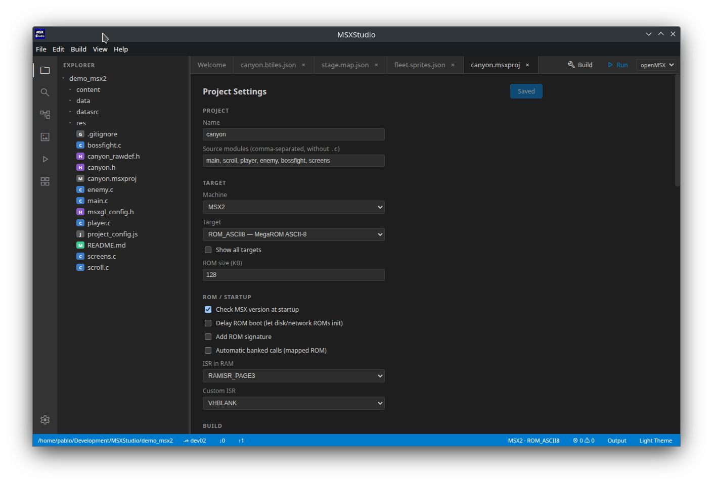

# Getting started

From a fresh install to a ROM booting in an emulator. Ten minutes, most of it
waiting for a download.

## 1. Install MSXDEVStudio

Grab the build for your system from the project's Releases page.

**Linux** — the `.AppImage` is portable (`chmod +x`, then run it); the `.deb`
installs with `sudo apt install ./msxdevstudio-*.deb`.

**Windows** — `msxdevstudio-*-setup.exe` installs, `msxdevstudio-*-portable.exe` is a
single file that does not. Windows SmartScreen will warn about both, because the
binaries are not code-signed yet; see [Troubleshooting](troubleshooting.md).

macOS is not packaged at the moment.

## 2. Let it fetch the toolchain

MSXDEVStudio does not bundle the MSX toolchain, and does not make you hunt for it
either. On first launch it offers to **download MSXgl** — which brings its own
SDCC compiler, MSXtk image tools and Node runtime — or to point at a checkout
you already have.

The download comes from
[MSXgl](https://github.com/aoineko-fr/MSXgl) itself. If `git` is on your PATH
MSXDEVStudio clones it, which makes later updates a `git pull`; otherwise it
fetches the ZIP of the `main` branch. On Linux it also marks the bundled
binaries executable, which a ZIP cannot record.

You can change any of this later in **Toolchain Settings** (File menu). It
resolves each tool the same way: an explicit setting first, then your `PATH`,
then the platform's usual location — and it validates by running the real
binaries, not by looking for filenames.

## 3. Choose how to run your games

You need somewhere for the ROM to boot. There are two options and you can
switch per project.

**openMSX** is the accurate one, and the one you supply yourself: install it
from [openmsx.org](https://openmsx.org/) or your distribution's packages, then
point MSXDEVStudio at the executable in Toolchain Settings. MSXDEVStudio writes that
path into MSXgl's own user-global config (`projects/default_config.js`),
preserving anything already in the file, so MSXgl's `run` step launches it.

**WebMSX** needs nothing installed: your game runs at webmsx.org in your
browser, with the ROM lent to the page over a loopback server on your own
machine. Chrome 141 and newer will ask you to allow local network access the
first time.

> **openMSX from the Linux `.tar.gz`?** That build cannot find its own `share/`
> directory. MSXDEVStudio detects the layout and sets `OPENMSX_SYSTEM_DATA` for
> you — no manual setup needed.

## 4. Make a project

**New Project** on the Welcome tab, or File ▸ New Project.

You choose a name, a location and a machine. MSXDEVStudio copies MSXgl's own
project template — the plain one for MSX1, `template_msx2` for anything
newer — giving you `main.c` and `msxgl_config.h`, and writes a `.msxproj`
beside them. The defaults are a 32 KB ROM for MSX1 with the `system`, `bios`,
`vdp`, `print`, `input` and `memory` engine modules; all of it is changeable in
[Project settings](project-settings.md).

To open a project later: double-click any `.msxproj` file, run
`msxdevstudio path/to/Game.msxproj`, or use the recent list on the Welcome tab. If
MSXDEVStudio is already running it focuses the existing window instead of starting
a second copy.

## 5. Build and run it

Press **F5**. That builds the project and launches it in your preferred
emulator; `Ctrl+Shift+B` builds without running.

Compiler messages are parsed into the **Problems** panel, and clicking one
jumps to the line. [Building and running](building-and-running.md) covers the
rest — incremental builds, the Clean and Rebuild commands, and what the exit
codes mean.

## Where to go next

- **[Tutorials](tutorials/README.md)** — start at [Hello
  world](tutorials/01-hello-world.md) and work through to software sprites.
  Each one ends with a complete program you can paste into `main.c` and Run.
- **[Resources](resources.md)** — the tile, sprite, map, screen and sound
  editors, and how what you draw becomes a C header your game includes.
- **The demo games** — **Help ▸ Install Demo Projects…** copies both into a
  folder you pick: `demo_msx1` is a finished MSX1 platformer, `demo_msx2` a
  SCREEN 5 shooter in a MegaROM. Open either `.msxproj` and press Run; each
  folder's README explains how every piece works.
- **[Keyboard shortcuts](shortcuts.md)** — worth two minutes early on.
