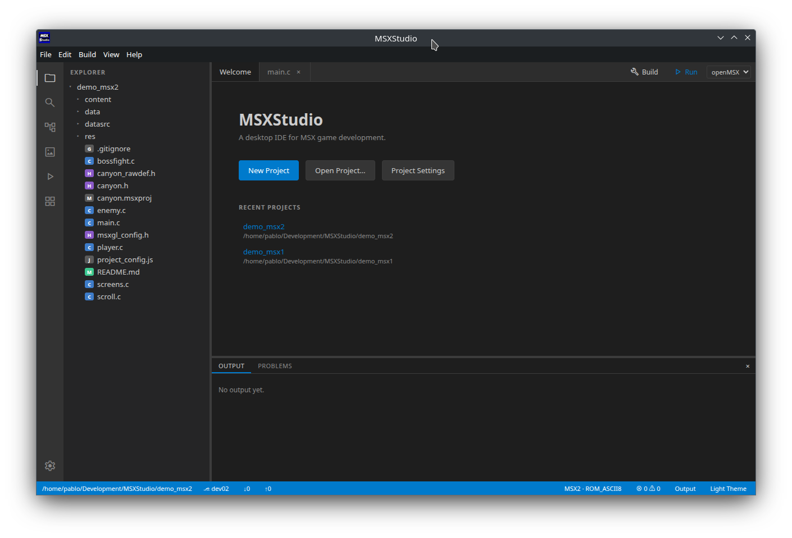
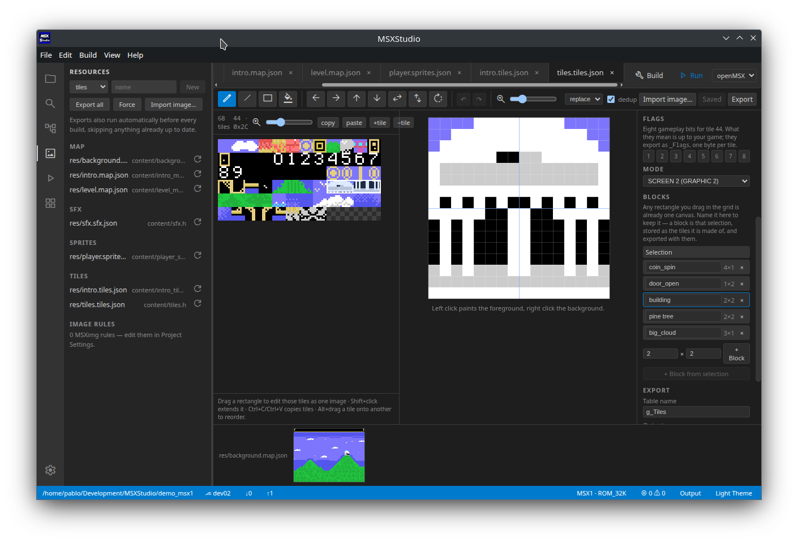
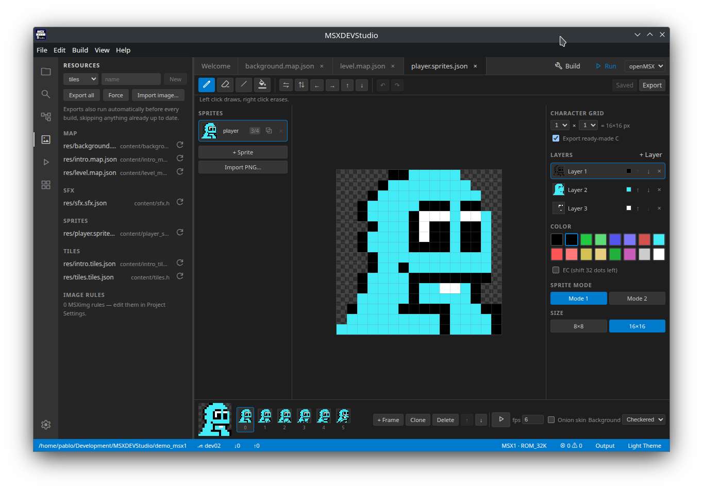
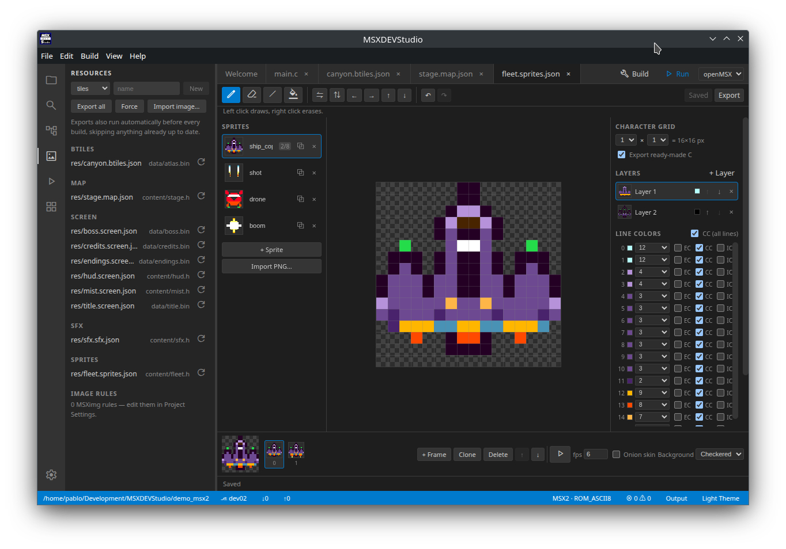
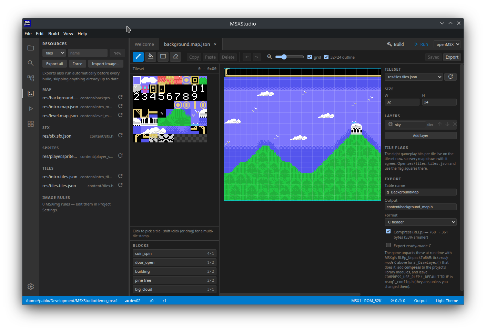
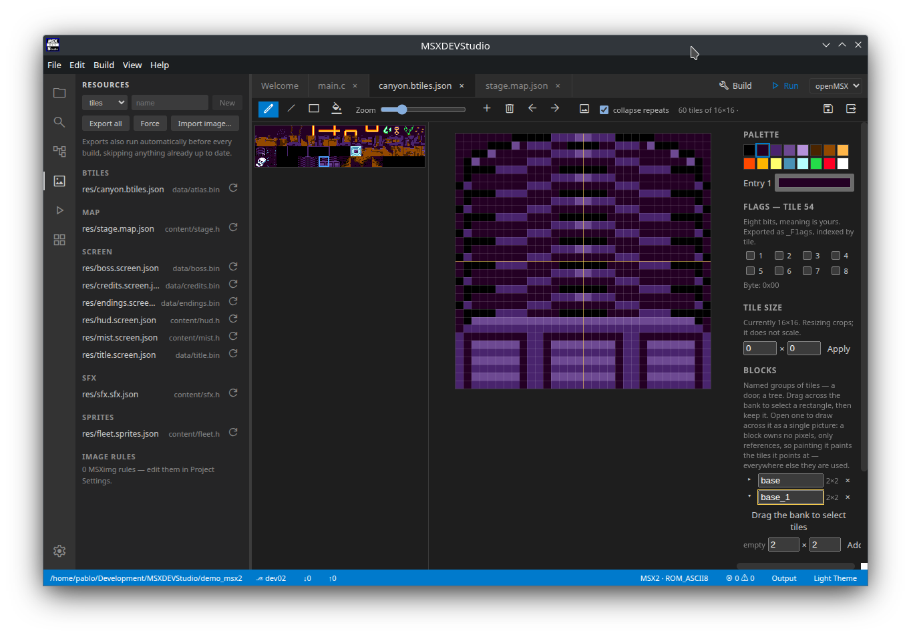
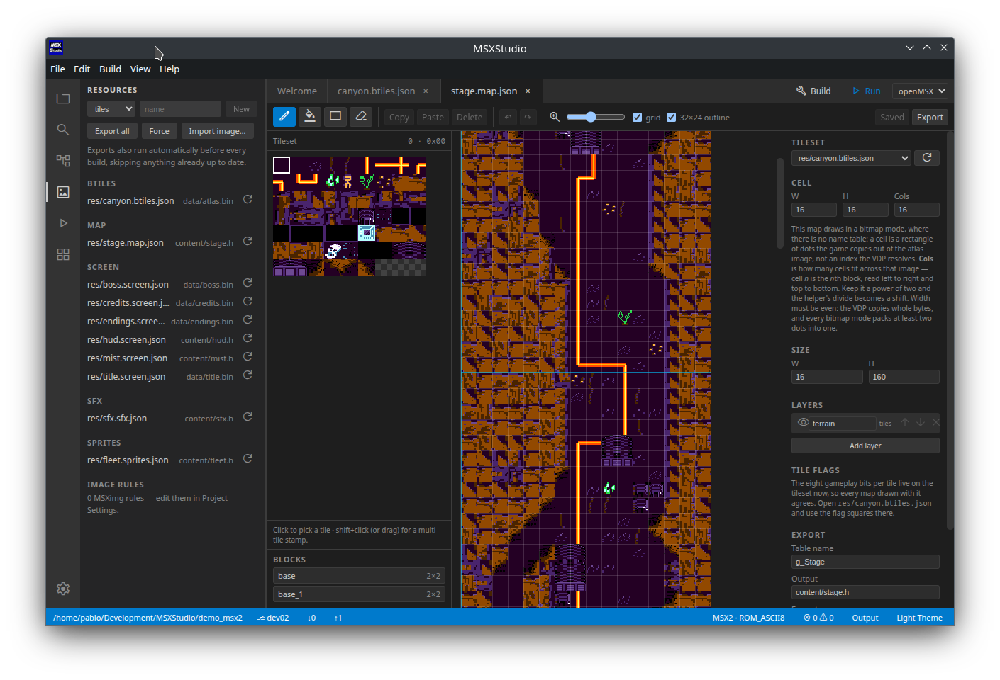

# Resources

Resources are the art and sound you make inside MSXDEVStudio. Each one is a file
in your project that an editor owns, and each one exports a C header your game
`#include`s.

| Kind | File | Editor | Use it for |
|---|---|---|---|
| tiles | `name.tiles.json` | Tile editor | 8×8 patterns for SCREEN 1/2/4 |
| bitmap tiles | `name.btiles.json` | Bitmap tile editor | Tilesets for the MSX2 bitmap modes (SCREEN 5–8) |
| meta-tiles | `name.meta-tiles.json` | Meta-tile editor | One design bigger than a tile, with frames and flags, that a map places |
| meta-tiles (bitmap) | `name.meta-btiles.json` | Meta-tile editor | The same, over a bitmap tileset |
| sprites | `name.sprites.json` | Sprite editor | 8×8 or 16×16 hardware sprites |
| map | `name.map.json` | Map editor | Tile layouts / levels |
| screen | `name.screen.json` | Screen editor | Full-screen MSX2 bitmaps (SCREEN 5–8) |
| sfx | `name.sfx.json` | SFX editor | ayFX sound effects |

## Creating and opening

In the **Resources** panel (side bar): pick a kind, type a name, press **New**.
The file is created in the project's **`res/`** folder and its editor opens.
Click any listed resource to reopen it later — or open the file from the
Explorer.

`res/` is where new resources go so the project root doesn't fill up with a
tileset, its maps, its sprite sheets and their sources. Nothing requires it:
the project is walked recursively, so a resource anywhere in it is still found,
listed and exported — projects made before this keep working untouched, and you
can move files into `res/` at your leisure. If you do move a tileset, fix the
**Tileset** dropdown in any map that referenced it (a map stores that path).

Exported headers are a separate thing and still go where the resource's
**Output** says, `content/` by default.



## The editors

**Tiles** — draw with pencil, line, rectangle and fill. Shift, mirror and
rotate the current tile; `+tile` and `−tile` grow and shrink the bank.
Colors depend on the mode: SCREEN 2/4 give you two colors per 8-pixel row,
SCREEN 1 gives one pair per group of 8 tiles. SCREEN 4 adds an editable
16-colour palette. The **Mode** dropdown converts between them, warning first
when the target can't hold what you have — going to SCREEN 1 keeps one pair
per group of eight and drops the rest. **Import image…** converts a PNG into a
whole tileset.

Deleting or dragging a tile renumbers the ones after it, and MSXDEVStudio rewrites
every map drawn with the tileset to match — open ones immediately, closed ones
when you next open them. The tile's flags and any block using it follow too, so
re-arranging a tileset never quietly changes what a level means.



**Tile flags** — eight numbered squares in the tile editor, in the manner of
PICO-8's sprite flags. They say what a tile *means* to your game rather than how
it looks: solid, collectable, deadly, whatever you decide. They belong to the
tileset, so every map drawn with it agrees, and they export as `_Flags`, one
byte per tile, only once some tile carries a bit.

```c
#define FLAG_SOLID 0x01          // flag 1 is bit 0
if (g_Tiles_Flags[tile] & FLAG_SOLID) { /* blocked */ }
```

That turns collision into a table lookup rather than a list of tile numbers in
your code, so re-arranging a tileset does not break the game. See
[`demo_msx1`](../demo_msx1/README.md) for it in use.

**Editing several tiles at once** — drag a rectangle in the tile grid and the
canvas shows those tiles as one image, seams drawn in blue. Nothing is copied:
you are painting the tiles themselves, across their boundaries. Shift+click
extends the rectangle from the current tile, and a plain click goes back to
editing one. (Reordering a tile is **Alt**+drag, because it renumbers the bank.)

**Tile blocks** — a door, a tree or a boss face is bigger than one tile, and
once you have drawn one you can keep it: **+ Block from selection** names the
rectangle you have selected. A block holds no pixels of its own, only references
to tiles in the same bank, so painting a block still paints those tiles — it is
the selection made permanent, and it is what the exporter writes out (see
*Blocks* under Export). **+ Block** instead appends that many blank tiles as a
new block, for starting from nothing. In SCREEN 1 a new block starts on a
colour-group boundary, because eight consecutive tiles share one FG/BG pair
there — the panel warns when a block can't own its whole group.



**Sprites** — mode 1 gives each sprite one colour; mode 2 gives a colour per
line, plus the EC/CC/IC bits. Sprites are 8×8 or 16×16 and can stack up to 4
layers for multicolour characters. The animation bar previews frames.



**Metasprites** — a character can span a grid of hardware sprites (the
*Character grid* control): 2×2 of 16×16 sprites is a 32×32 Metal Gear-style
hero that moves as one — sprites side by side rather than stacked. Click a cell
on the canvas to draw on it; a cell you emptied gets a plane back when you click
it. Each cell is a separate hardware sprite and each of its layers costs
another, so every character shows what it spends of the VDP's 4 (mode 1) or
8 (mode 2) sprites per scanline.

**Compressing a map** — a name table is mostly runs of the same tile, so the
map editor's Export block offers **Compress (RLEp)**, with the two sizes shown
next to the checkbox so the trade is visible before you take it (a screen of
sky and ground is typically 768 → under 40 bytes). RLEp is *MSXgl's own* format:
the game unpacks with `RLEp_UnpackToRAM` from the engine's `compress` module —
add that module in Project Settings, and leave `COMPRESS_USE_RLEP` and
`COMPRESS_USE_RLEP_DEFAULT` TRUE in `msxgl_config.h` (they are by default).
Tick **Export ready-made C** for a `_DrawLayer()` that unpacks and writes to
the name table in one call, and size your buffer with the generated
`..._UNPACKED_SIZE`.

A layer that packs no smaller than raw is shipped raw instead — and because one
`_DrawLayer()` serves every layer, one such layer turns compression off for the
whole map rather than leaving a helper that is wrong for one of the tables. The
generated header's parameter block always says which of the two happened.



**Map** — pick a tileset first (dropdown in the side panel), then paint with
stamp, fill, rectangle and erase. Shift+click or drag in the tile picker takes
a multi-tile stamp. A 32×24 map is exactly one screen; larger maps get a screen
outline overlay for designing scrolling worlds.

In a **bitmap mode** a layered map needs to know which cell means "nothing",
because a cell index is an atlas position and 0 is a picture like any other. So
a layered bitmap map names its own **transparent cell** (the checkbox under
*Cell*), and the export then adds a `_DrawRowOver()` beside `_DrawRow()` that
skips that index instead of blitting it — draw the background row first, then
the overlay. Leave it off and every cell is drawn, which is what a single-layer
map wants; the Problems panel points it out if a map grows a second layer
without one.

In a **pattern mode** there is no equivalent, and that is the hardware talking:
`_DrawLayer()` writes the whole rectangle in one `VDP_WriteLayout_GM2`, so there
is no per-cell decision to hook. A foreground layer there is something you
compose yourself, row by row, before writing it — usually by giving the
see-through tile a flag and testing it as you build each row.

**Meta-tiles** — the hardware's unit is an 8×8 cell, and almost nothing in a
game is 8×8. A **meta-tile** is one design several cells across — a tree, a
door, a spinning coin — with its own size, its own animation frames and its own
eight gameplay flag bits. One file is one meta-tile.

It owns no pixels. Like a tileset's blocks, a meta holds tile *indices*; the
editor shows it as a picture and resolves every stroke to tiles in the tileset
it references, creating them as it goes and reusing one whenever the same 8×8
appears twice. So painting a meta grows the tileset, and never changes a tile
something else is already using.

**Tile 0 is the transparent one.** A tileset opts in (side panel → **Reserve
tile 0**), after which tile 0 is locked blank, drawn as a checkerboard, and
*skipped* when a meta is stamped — which is the only transparency a name table
has. Reserving it on a tileset that already uses tile 0 as art shifts every
index up by one and renumbers the maps drawn with it, so the editor asks first.

Create one from the Resources panel (`meta-tiles`), point it at a tileset, set
its size, and draw: pencil, line, rectangle, fill, spray and erase, over the
MSX1 palette or the tileset's SCREEN 4 one. **Frames** are along the bottom, with
onion skin and playback. Painting in SCREEN 1 offers only the two colours that
tile's group already spends, because all eight tiles in a group share one pair.

To use one, open a map and pick it from the **lower half** of the left sidebar —
tiles above, meta-tiles below. Only metas drawn over that map's tileset are
offered. Click to place, click a placed one to select it, drag to move, Delete
to remove.

A placement is a **live reference** by default: the grid under it holds tile 0,
the game draws it from the placement table each time, and it can animate. Tick
**Bake into the layer** for static scenery instead — frame 0's tiles go into the
grid, so the ordinary layer write already draws it and it costs nothing at
runtime. Painting a tile inside a baked placement drops its record, because the
grid no longer holds what the record claims.

Undo leaves tiles behind: a stroke that created a tile and was then undone still
grew the bank. **Compact unused tiles** in the meta's side panel reclaims the
ones *this editing session* created and no longer uses. It is deliberately not
"every tile nothing refers to" — a tile used only by a map you do not have open
would look exactly the same, and removing it would silently change that map.

**Bitmap tiles** — the SCREEN 5/6/7/8 counterpart of a pattern tileset, and a
different thing from a screen. A screen is one picture used as it is; a tileset
is a bank of small images addressed by number, which a map indexes and the game
blits. It is deliberately shaped like the pattern tileset — the same tile flags,
the same named blocks, the same renumbering when you reorder — and differs only
where the hardware does:

- **Pixels, not patterns.** A pattern tile is eight pattern bytes plus colour
  attributes. A bitmap tile is one palette index per pixel, packed on export to
  whatever the mode holds — two per byte in SCREEN 5, four in SCREEN 6.
- **Any size.** A pattern tile is 8×8 because the name table says so. Nothing in
  a bitmap mode cares, so the size belongs to the tileset: 16×16 for chunky art,
  8×8 for fine, 32×16 if that is what the picture wants.
- **Cut from an image, as well as drawn.** Import a PNG and slice it into cells,
  which is what makes this usable for art made outside MSXDEVStudio.



Without it, a bitmap-mode map has to point its tileset at a picture and read it
as an implicit grid. That works, but it costs what a tileset is *for*: no
gameplay flags, so collision falls back to comparing tile numbers against
ranges; no blocks; and the tile order becomes load-bearing, because it is the
only thing carrying meaning.



The tiles are uploaded to VRAM as a grid rather than one long strip — fifty
16-dot tiles in a row would be 800 dots wide and VRAM is 256 across — and the
exported code indexes into that sheet for you.

**Screen** — for MSX2 bitmap modes only. Import a source image, then retouch
the conversion with pencil/fill and edit the palette. For MSX1 full-screen art,
draw a tileset and place it in a map instead.

**Fragments** — bitmap modes have no name table, so the block idea arrives as a
**fragment**: pick the **cut** tool (the dashed-corners icon) and drag a rectangle on the converted image to
name a cut-out of it. Fragments are bitmap-mode blocks *and* the frames of a
software sprite; like blocks they hold no pixels, so retouching the image
updates every fragment over it.

**Compressing a picture** — a SCREEN 5 image is 27 KB, so the screen editor's
Export block has the same **Compress (RLEp)** checkbox, with both sizes shown.
It packs in **bands** rather than in one piece, precisely because no 32K-ROM
program could unpack 27 KB in RAM: each band is one buffer's worth of lines
(`..._BAND_BYTES`, 2 KB — 16 lines in SCREEN 5), and the generated
`_Unpack(buffer, y)` unpacks one and blits it with `HMMC` before touching the
next, so the whole picture never has to be anywhere but VRAM. `_Bands` is the
u16 offset table it walks.

The palette and any fragment strip stay uncompressed: they are small, and the
strip is uploaded straight from ROM in one `HMMC`. As with maps, a picture that
packs no smaller than raw is shipped raw — dithering in particular defeats
run-length coding, so check the numbers next to the checkbox before assuming.

**SFX** — one file holds a bank of effects. Draw tone, noise and volume per
frame, press Play to hear it. Start from a preset, or import `.afx`/`.afb`
files from AYFX Editor. An effect's position in the list is the id you pass to
`ayFX_PlayBank()`, so reordering renumbers them.

## Exporting

Every editor has an **Export** block in its side panel:

- **name** — the C variable, e.g. `g_MyTiles`
- **out** — where to write it, e.g. `content/mytiles.h`
- **format** — `c` for a header, `bin` for raw bytes
- **Export ready-made C** — appends working code for the thing you just drew
  (see below). Off by default, because it calls into MSXgl.

Exports run automatically before every build, and skip anything already up to
date. To export by hand, use the **Export** button in the editor toolbar, or
**Export all** in the Resources panel.

A generated header defines one array per table, plus a size define:

```c
#define G_MYTILES_PATTERNS_SIZE 768
const unsigned char g_MyTiles_Patterns[] = { ... };
const unsigned char g_MyTiles_Colors[] = { ... };
```

Never edit generated headers — they are overwritten on every build.

## Using resources in code

Include the header, then load the arrays into VRAM. All examples assume
`#include "msxgl.h"` at the top of your `.c` file.

### Tiles

Exports `_Patterns`, `_Colors`, and `_Palette` on SCREEN 4.

```c
#include "content/mytiles.h"

VDP_SetMode(VDP_MODE_GRAPHIC2);            // SCREEN 2
VDP_LoadPattern_GM2(g_MyTiles_Patterns, 64, 0);  // 64 tiles, starting at tile 0
VDP_LoadColor_GM2(g_MyTiles_Colors, 64, 0);
```

`VDP_LoadPattern_GM2` mirrors the data into all three SCREEN 2 banks for you.
Pass `0` as the count to mean all 256 tiles. On SCREEN 1 there are no banks to
mirror, so write the tables directly instead:

```c
VDP_WriteVRAM(g_MyTiles_Patterns, g_ScreenPatternLow, g_ScreenPatternHigh, 64 * 8);
VDP_WriteVRAM(g_MyTiles_Colors, g_ScreenColorLow, g_ScreenColorHigh, 32);
```

### Sprites

Exports `_Patterns`, `_Colors`, and `_Palette` in mode 2.

```c
#include "content/myhero.h"

VDP_EnableSprite(TRUE);
VDP_SetSpriteFlag(VDP_SPRITE_SIZE_16);
VDP_LoadSpritePattern(g_MyHero_Patterns, 0, 4);  // 16×16 sprite = 4 patterns

// Mode 1 (MSX1): one colour per sprite
VDP_SetSpriteSM1(0, x, y, 0, COLOR_WHITE);

// Mode 2 (MSX2): colour per line, 16 bytes per sprite in _Colors
VDP_SetSpriteExMultiColor(0, x, y, 0, g_MyHero_Colors);

VDP_DisableSpritesFrom(1);                 // hide the rest
```

### Map

Exports one array per layer, named after the layer — the default layer
`background` becomes `g_MyMap_Background`. It is one byte per cell, so a 32×24
map is 768 bytes you can blit straight into the name table:

```c
#include "content/mymap.h"

VDP_WriteVRAM(g_MyMap_Background, g_ScreenLayoutLow, g_ScreenLayoutHigh, 32 * 24);
```

Load the map's tileset first, or you'll see the wrong patterns. For maps wider
than one screen, add MSXgl's `scroll` module to LibModules and pass the array
to `Scroll_Initialize((u16)g_MyMap_Background)` instead.

Collision comes from the tileset's flags rather than from the map, so the same
map data serves both the VDP and the game logic:

```c
u8 tile = g_MyMap_Background[y * 32 + x];
if (g_MyTiles_Flags[tile] & FLAG_SOLID) { /* blocked */ }
```

### Meta-tiles

The set exports one table of tile indices at a fixed stride, plus `_META_W`,
`_META_H`, `_COUNT`, and a `#define` per meta you named:

```c
#include "content/canyon_metatiles.h"

// tile (sx, sy) of meta `m`
u8 tile = g_CanyonMetatiles[m * (G_CANYONMETATILES_META_W * G_CANYONMETATILES_META_H)
                            + sy * G_CANYONMETATILES_META_W + sx];
```

A map drawn with it exports its layers as meta indices, and gains `_META_W`,
`_META_H`, `_META_CELLS` (the stride) and `_TILE_W`/`_TILE_H` — its size in
tiles, since `_W`/`_H` now count metas. With **Export ready-made C** on:

```c
// Paint a window straight to the name table — `rowbuf` is _TILE_W bytes.
u8 rowbuf[G_LEVEL_TILE_W];
g_Level_DrawView(g_Level_Terrain, g_CanyonMetatiles, rowbuf, camX, camY, 0, 0, 32, 24);

// …or expand it to plain tiles in RAM, when the game reads and writes the map.
u8 world[G_LEVEL_TILE_W * G_LEVEL_TILE_H];
g_Level_ExpandToRAM(g_Level_Terrain, g_CanyonMetatiles, world);
u8 tile = world[y * G_LEVEL_TILE_W + x];
if (g_MyTiles_Flags[tile] & FLAG_SOLID) { /* blocked */ }
```

There is no `_DrawLayer()` on a meta map — writing meta indices into the name
table would draw whichever tiles happen to share those numbers. `_DrawView()`
over the whole map is the equivalent, and it is the cheaper of the two: a
`_TILE_W`-byte row buffer instead of the whole map in RAM. A bitmap meta map
keeps `_DrawRow()` exactly as it was, plus the set's table, and still issues one
`HMMM` per cell.

If the layers are compressed, unpack them yourself once with `RLEp_UnpackToRAM`
— the meta helpers read an unpacked layer. That is what you want anyway: a meta
layer is small enough to keep in RAM and change as the game runs.

### Screen

Exports `_Palette` (when the mode has one) and `_Data`.

```c
#include "content/title.h"

VDP_SetMode(VDP_MODE_SCREEN5);
VDP_SetPalette(g_Title_Palette);           // 16 entries, 2 bytes each
VDP_WriteVRAM(g_Title_Data, g_ScreenLayoutLow, g_ScreenLayoutHigh, G_TITLE_DATA_SIZE);
```

### SFX

Exports the whole bank as one array. Add `"ayfx/ayfx_player"` to **LibModules**
in Project Settings first.

```c
#include "content/sounds.h"

ayFX_InitBank(g_Sounds);
ayFX_SetChannel(PSG_CHANNEL_A);

ayFX_PlayBank(0, 0);                       // effect id 0, priority 0
```

`ayFX_Update()` must run once per frame, and it only fills a register buffer —
something has to push that buffer to the PSG:

```c
void VBlankHook()
{
    ayFX_Update();
    PSG_Apply();       // if you also use PT3 music, call PT3_UpdatePSG() instead
}
```

Author your effects at the same rate you call `ayFX_Update()` — set 50 Hz for
PAL or 60 Hz for NTSC in the SFX editor.

## Ready-made C

Tick **Export ready-made C** in the side panel and the generated header carries
the code that drives what you drew, so you get a working object without writing
the VDP plumbing by hand. It calls into MSXgl, so include `msxgl.h` first.

**Sprite groups** — a metasprite, a stack of superposed planes, or both. The
header defines where each character starts, and one call places the whole group:

```c
g_Actors_SetMeta(0, x, y, G_ACTORS_HERO_BASE + frame * G_ACTORS_HERO_PLANES,
                 G_ACTORS_HERO_PLANES);
```

**Tile blocks** — stamps a block's tile indices into the name table. Needs
`VDP_USE_MODE_G2` or `VDP_USE_MODE_G3`:

```c
g_Scenery_DrawBlock(10, 5, G_SCENERY_DOOR_BASE, G_SCENERY_DOOR_W, G_SCENERY_DOOR_H);
```

**Meta-tiles** — the same idea, for a set rather than a tileset. A meta's size is
known at compile time, so the call takes a frame rather than a size:

```c
g_Tree_Draw(10, 5, 0);        // frame 0 at tile column 10, row 5
```

A map that places meta-tiles exports a placement table beside its layers, and
with helpers on, the runtime that walks it:

```c
u8 frames[G_LEVEL_METAS] = { 0 };
g_Level_DrawLayer(g_Level_Background, 0, 0);   // the grid, one call
g_Level_DrawPlacements(frames);                // the live metas over it
```

`frames[slot]` is the frame each meta currently shows, so animating a placed
meta is advancing that array and calling `_DrawPlacements` again. Baked
placements are skipped — their tiles are already in the layer.

**Software sprites** (MSX2, `VDP_USE_COMMAND`) — characters drawn *into* the
screen, so the per-scanline sprite limit does not apply. The fragments are
exported as one strip; upload it once, then restore and draw each object:

```c
g_Actors_Upload(212);                 // strip parked below the visible lines
g_Actors_SwSprite hero = { 0 };       // slot 0 — one backup column per object
// every frame:
g_Actors_Restore(&hero, 212);
g_Actors_Draw(&hero, G_ACTORS_HERO_IDLE, x, y, 212);
```

Two rules the generated comments repeat: give every object its own `slot`, and
when objects can overlap, restore them all in reverse draw order before drawing
them all in order.
